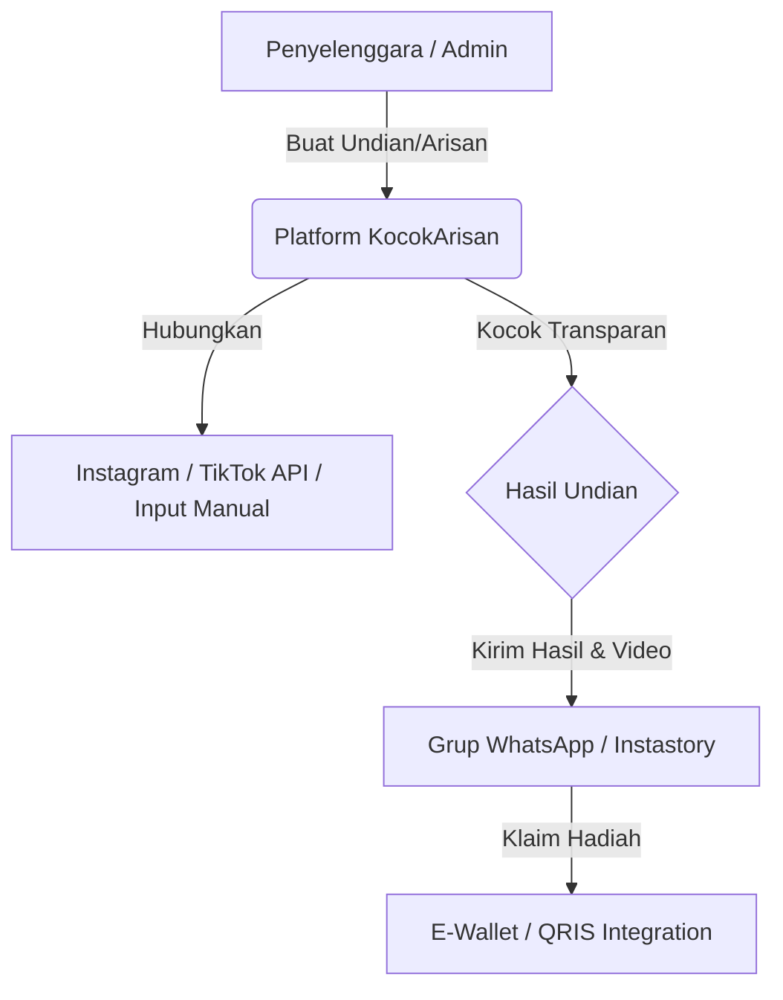

# Laporan Model Bisnis: KocokArisan / GoWin (Ide A)
*Platform Arisan & Giveaway Digital Transparan dan Terintegrasi Sosial Media & E-Wallet untuk Indonesia*

---

## 1. Skema Ekosistem & Alur Pengguna

---

## 2. Proposisi Nilai (Value Proposition)
* **Transparansi Mutlak:** Menghilangkan tuduhan "setting-an" atau manipulasi dengan sistem verifikasi publik berbasis hash unik yang dapat dilacak peserta secara independen.
* **Akses Mudah Tanpa Instal:** Peserta atau pengikut tidak perlu mengunduh aplikasi di App Store/Play Store; cukup akses via tautan web responsif di ponsel.
* **Integrasi Konten Media Sosial:** Hasil pengocokan bisa diunduh dalam bentuk infografis atau video pendek (berformat Reels/TikTok) untuk langsung dibagikan ke grup WhatsApp atau Instagram Story.
* **Pembayaran Arisan Otomatis:** Integrasi dengan e-wallet lokal untuk pengumpulan uang arisan secara otomatis dan terjadwal.

---

## 3. Segmen Pelanggan (Customer Segments)
1. **Kreator Konten & Admin Media Sosial (Micro-Influencer):** Mereka yang sering mengadakan *giveaway* untuk meningkatkan keterlibatan pengikut tetapi membutuhkan alat pengundian yang tepercaya dan bermerek.
2. **Ibu Rumah Tangga & Komunitas Sosial:** Pengelola arisan keluarga, arisan RT/RW, arisan kantor, atau kelompok arisan sosialita.
3. **Brand & UMKM Lokal:** Bisnis yang menggunakan kampanye *giveaway* untuk promosi produk baru di Instagram/TikTok.

---

## 4. Fitur Utama & Arsitektur Produk
* **Sistem Impor Data Fleksibel:** Impor nama peserta dari file Excel/CSV, salinan komentar postingan Instagram (menggunakan scraping API), atau entri nama manual secara cepat.
* **Animasi Pengocokan Visual Premium:** Berbagai pilihan animasi seperti Roda Keberuntungan (Spin the Wheel), mesin slot, atau animasi kartu keberuntungan yang bisa di-*branding* dengan logo penyelenggara.
* **WhatsApp Notification Bot:** Pengiriman pesan otomatis kepada pemenang arisan/giveaway berisi ucapan selamat dan petunjuk klaim hadiah.
* **Buku Kas Arisan (Arisan Ledger):** Sistem pencatatan iuran arisan bulanan sehingga anggota bisa melihat status pembayaran dan siapa saja yang sudah mendapatkan kocokan.

---

## 5. Sumber Pendapatan (Revenue Streams)
* **Paket Premium Event (Pay-per-Use):**
  * **Tarif:** Rp15.000 per pengocokan / Rp49.000 per bulan.
  * **Manfaat:** Dukungan peserta >1.000 orang, branding logo sendiri pada layar pengocokan, unduh video animasi HD hasil kocokan untuk konten media sosial.
* **Sistem Buku Arisan Premium:**
  * **Tarif:** Rp10.000 per kelompok arisan/bulan.
  * **Manfaat:** Pengingat otomatis via WhatsApp untuk anggota yang belum membayar iuran arisan.
* **Biaya Transaksi (Transaction Fee):** 
  * Potongan sebesar Rp1.000 - Rp2.000 untuk setiap transaksi pembayaran iuran arisan melalui dompet digital (GoPay, OVO, ShopeePay, DANA) di dalam platform.

---

## 6. Strategi Go-To-Market (GTM)
* **Strategi Plak-dan-Bagikan (Organic Share Loop):** Setiap kali hasil kocokan arisan dikirim ke grup WhatsApp keluarga/RT, infografis hasil kocokan akan mencantumkan tautan: *"Dikocok menggunakan KocokArisan.com. Gratis, transparan, dan mudah."* Ini akan memicu pendaftaran organik baru.
* **Kemitraan Influencer Mikro:** Memberikan akun premium gratis kepada influencer mikro (followers 10k-50k) dengan syarat mereka membagikan video pengundian yang berlogo KocokArisan di Instagram Story/Reels mereka.

---

## 7. Rencana Estimasi Biaya & Tech Stack
* **Teknologi:** React/Next.js, TailwindCSS, Supabase (Database & Auth), Midtrans/Xendit (Payment Gateway).
* **Biaya Awal Bulanan:**
  * Domain `.com` / `.id`: ~Rp150.000 (sekali bayar per tahun)
  * Hosting & DB: Vercel + Supabase (Gratis di awal)
  * API WhatsApp Notification: ~Rp100.000/bulan (paket basic pihak ketiga seperti Fonnte)
